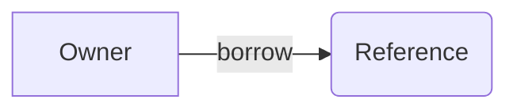

## Goal

สร้าง Slidev project ใน drive D ตามชื่อที่ระบุ และเปิด browser เพื่อดู slides ทันที

## Scope

สร้าง `slides.md` เอง พร้อม headmatter และ per-slide frontmatter มาตรฐาน ไม่ต้องสร้าง `package.json` — dependencies อยู่ที่ root `D:/newkub/slides/package.json` แล้ว แล้วเปิด browser อัตโนมัติ

## Execute

### 1. Create Project Directory

1. รับชื่อ project เป็น parameter (เช่น `rust`)
2. สร้าง directory `D:/newkub/slides/{project-name}` ถ้ายังไม่มี
3. สร้าง subdirectories: `components/`, `layouts/`, `public/`, `styles/`

### 2. Verify Root Dependencies

1. ตรวจสอบว่า `D:/newkub/slides/package.json` มีอยู่แล้ว
2. ถ้าไม่มี ให้ทำ `/follow-slidev` เพื่อสร้าง root setup
3. ไม่ต้องสร้าง `package.json` ของ project — dependencies อยู่ที่ root

### 3. Create Slides File

สร้าง `slides.md` ด้วย headmatter และ per-slide frontmatter:

1. เขียน headmatter (first `---` block) สำหรับ global config
2. เขียน per-slide frontmatter สำหรับแต่ละ slide
3. แยก slides ด้วย `---` separator

#### Headmatter Fields

```yaml
---
theme: seriph
title: Presentation Title
info: |
  คำอธิบาย presentation แบบย่อ
class: text-center
transition: slide-left
mdc: true
drawings:
  persist: false
---
```

#### Per-slide Frontmatter Fields

```yaml
---
layout: two-cols
class: my-class
background: /image.png
transition: fade-out
---
```

### 4. Use Built-in Layouts

เลือก layout ตามเนื้อหา:

- **`cover`** — title slide หน้าแรก
- **`center`** — content กึ่งกลาง
- **`default`** — content ทั่วไป
- **`two-cols`** — สองคอลัมน์ ใช้ `::right::` slot
- **`fact`** — เน้น fact หรือ data
- **`full`** — เต็มจอ
- **`end`** — หน้าสุดท้าย
- **`section`** — section divider
- **`quote`** — แสดง quote

### 5. Add Code Blocks

ใช้ Shiki syntax highlighting พร้อม features:

- ใช้ `{2|4-6|all}` สำหรับ line highlighting
- ใช้ `[filename.rs]` สำหรับ filename label
- ใช้ `{monaco}` สำหรับ editable Monaco editor
- ใช้ `{monaco-run}` สำหรับ executable code
- ใช้ `twoslash` สำหรับ TypeScript type info
- ใช้ `<<< @/path/to/file.ts` สำหรับ import external snippet
- ใช้ magic-move (4 backticks) สำหรับ animate code transitions

### 6. Add Diagrams

ใช้ Mermaid สำหรับ diagrams:



### 7. Add Animations

- ใช้ `v-click` สำหรับ step-by-step reveals
- ใช้ `<v-clicks>` component สำหรับ lists
- ใช้ `v-motion` สำหรับ motion effects
- ใช้ `v-mark` สำหรับ annotations

### 8. Run Dev Server

1. ทำ `/run-dev` เพื่อรัน dev server ด้วย `bunx slidev`
2. รอให้ dev server เริ่มทำงาน

## Rules

### 1. Project Setup

- สร้าง project ใน `D:/newkub/slides/{project-name}` เท่านั้น
- **ไม่สร้าง `package.json` ของ project** — ใช้ root `package.json` อย่างเดียว
- ใช้ Bun เป็น package manager ตาม global rules
- สร้าง subdirectories เฉพาะที่จำเป็น: `components/`, `layouts/`, `public/`, `styles/`

### 2. Headmatter Standards

- ตั้ง `theme: seriph` เป็น default
- ตั้ง `transition: slide-left` เป็น default
- เปิด `mdc: true` สำหรับ MDC syntax
- ตั้ง `drawings.persist: false` ถ้าไม่ต้องการ persist drawings

### 3. Layout Selection

- หน้าแรกใช้ `cover` layout
- หน้าสุดท้ายใช้ `end` layout
- เนื้อหาทั่วไปใช้ `default` layout
- เปรียบเทียบใช้ `two-cols` layout
- เน้นข้อมูลใช้ `fact` layout

### 4. Code Blocks

- ใช้ line highlighting `{2|4-6|all}` สำหรับ step-by-step
- ใช้ filename label `[main.rs]` สำหรับระบุไฟล์
- ใช้ magic-move สำหรับ animate code changes
- ไม่เกิน 15 บรรทัดต่อ code block

### 5. Animations

- ใช้ `v-click` สำหรับ reveal ทีละจุด
- ใช้ `<v-clicks>` สำหรับ lists ทั้งหมด
- ใช้ `v-motion` สำหรับ motion effects
- ไม่ใช้ animation มากเกินไป

### 6. Dev Server

- รัน `bunx slidev {project-name}/slides.md` ที่ root directory
- ใช้ `http://localhost:3030` เป็น default URL
- ถ้า dev server ไม่เริ่ม ให้แก้ไขก่อน

## Expected Outcome

- Slidev project สร้างใน `D:/newkub/slides/{project-name}`
- ไม่มี `package.json` ของ project — ใช้ root `package.json` อย่างเดียว
- `slides.md` มี headmatter และ per-slide frontmatter ครบถ้วน
- Dev server ทำงานได้ที่ port 3030
- สามารถแก้ไข slides แบบ real-time
